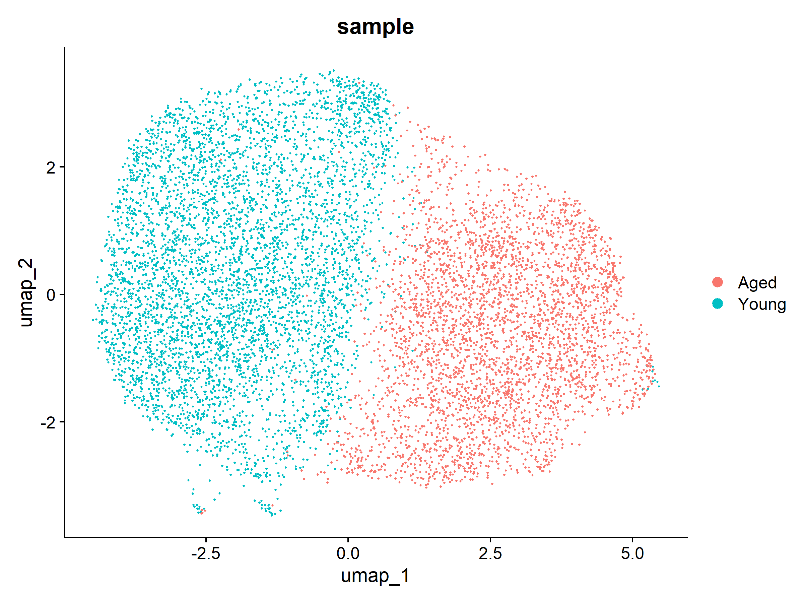
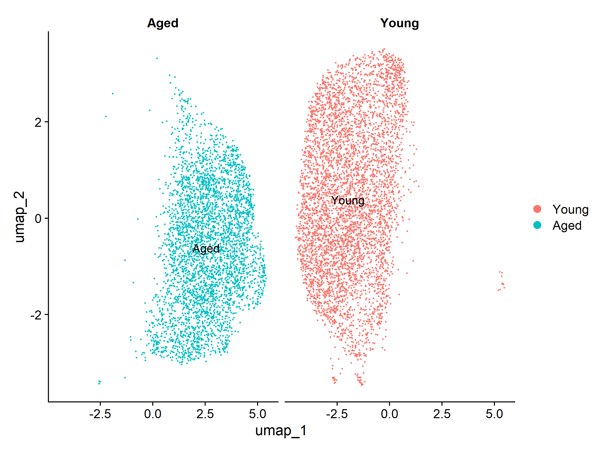
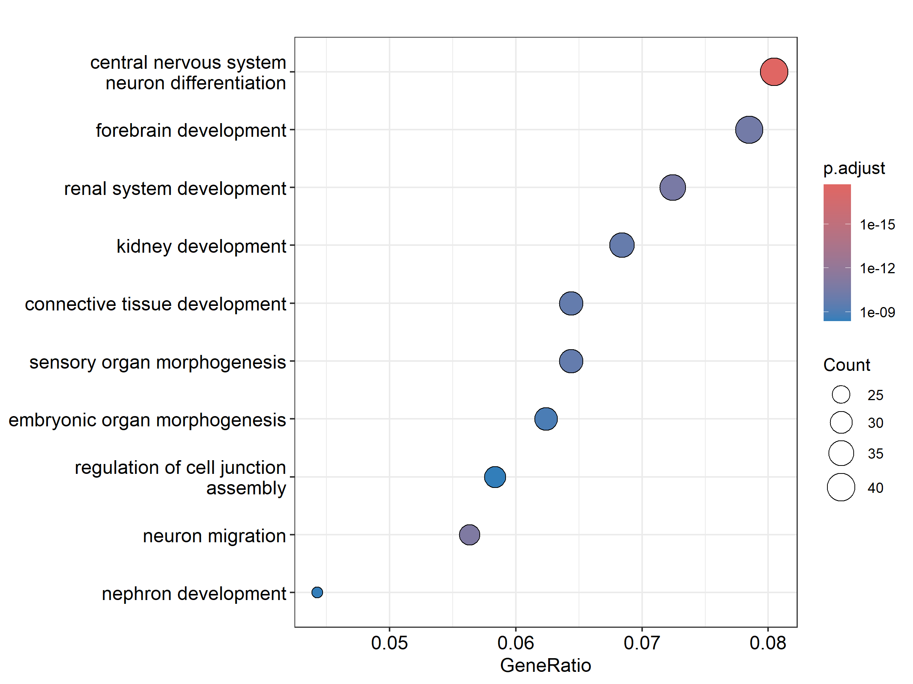
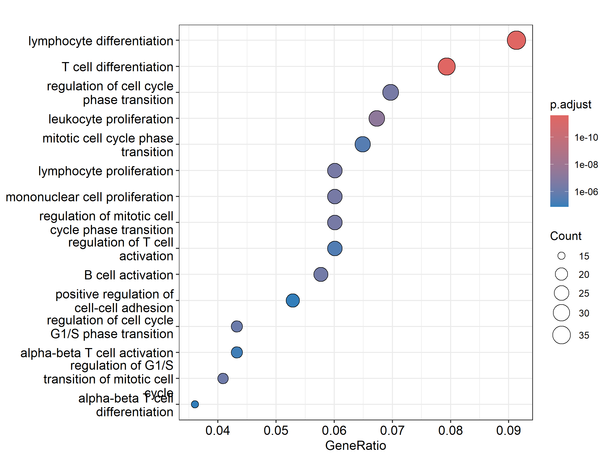

# Aged_HSC_scATACseq_Reanalysis 
Re-analysis of single-cell ATAC-seq data from young and aged hematopoietic stem cells using Signac and Seurat.

## Overview

This repository contains a re-analysis of single-cell ATAC-seq data from young and aged hematopoietic stem cells (HSCs) using Signac and Seurat.

## Objectives

- Identify age-associated chromatin accessibility changes.
- Characterize differentially accessible regions (DARs).
- Associate DARs with nearby genes.
- Determine biological pathways affected during aging.

## Dataset

Publicly available single-cell ATAC-seq data from young and aged hematopoietic stem cells (HSCs).

GEO Series:
- GSE190424 – Epigenetic traits inscribed in chromatin accessibility in aged hematopoietic stem cells (single-cell ATAC-seq)

Related study:
- GSE162662 – Epigenetic traits inscribed in chromatin accessibility in aged hematopoietic stem cells

## Workflow

1. Data loading and preprocessing
2. TF-IDF normalization
3. LSI dimensional reduction
4. UMAP visualization
5. Clustering
6. Differential accessibility analysis
7. Peak annotation
8. GO enrichment analysis
9. Gene activity analysis

## Main Findings
### Differential Accessibility

- Open DARs: 627
- Closed DARs: 499

### Chromatin Accessibility Changes

Open DARs were enriched for developmental and morphogenesis-associated pathways.

Closed DARs were enriched for lymphocyte differentiation, T-cell differentiation, B-cell activation and immune regulatory pathways.

### Cluster Composition
Aged HSCs were predominantly enriched in Cluster 0, whereas young HSCs were enriched in Cluster 1, indicating age-associated shifts in chromatin accessibility states.
| Sample | Cluster 0 | Cluster 1 | Cluster 2 |
|---------|---------:|---------:|---------:|
| Aged | 3328 | 259 | 107 |
| Young | 1220 | 3800 | 8 |

## UMAP Visualization
Young and aged HSCs occupy distinct chromatin accessibility states, with a strong age-associated shift in cluster distribution.





### GO enrichment of open DARs


Open DARs were enriched for developmental and morphogenesis-associated pathways, suggesting age-related remodeling of chromatin accessibility.

### GO enrichment of closed DARs


Closed DARs were enriched for lymphocyte differentiation and immune regulatory pathways, consistent with loss of lineage-associated accessibility during aging.

## Repository Structure

```
Aged_HSC_scATACseq_Reanalysis
│
├── figures/
├── results/
├── scripts/
├── README.md
```

## Results Files

Located in `results/`

- DARs_20k_LR.csv
- Aged_open_DAR_genes.csv
- Aged_closed_DAR_genes.csv
- GO_open_DARs.csv
- GO_closed_DARs.csv

## Software

- R
- Seurat
- Signac
- clusterProfiler
- org.Mm.eg.db

## Author

Soumen Manna
